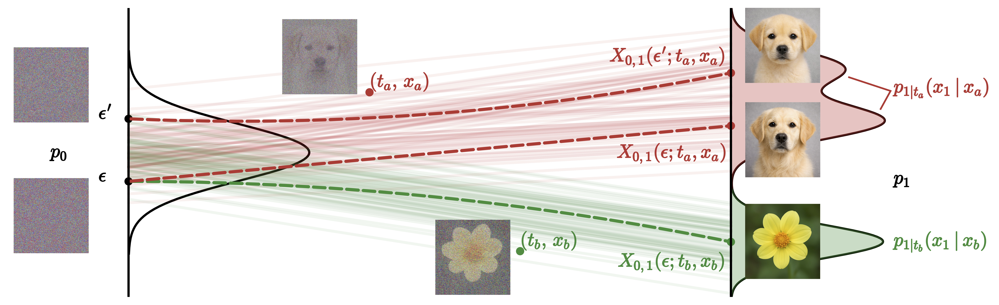

<div align="center">

# Meta Flow Maps

</div>

**Abstract:** Controlling generative models is computationally expensive. This is because optimal alignment with a reward function--whether via inference-time steering or fine-tuning--requires estimating the value function. This task demands access to the conditional posterior p1|t(x1|xt), the distribution of clean data x1 consistent with an intermediate state xt, a requirement that typically compels methods to resort to costly trajectory simulations. To address this bottleneck, we introduce Meta Flow Maps (MFMs), a framework extending consistency models and flow maps into the stochastic regime. MFMs are trained to perform stochastic one-step posterior sampling, generating arbitrarily many i.i.d. draws of clean data x1 from any intermediate state. Crucially, these samples provide a differentiable reparametrization that unlocks efficient value function estimation. We leverage this capability to solve bottlenecks in both paradigms: enabling inference-time steering without inner rollouts, and facilitating unbiased, off-policy fine-tuning to general rewards. Empirically, our single-particle steered-MFM sampler outperforms a Best-of-1000 baseline on ImageNet across multiple rewards at a fraction of the compute.

<div align="center">
  
</div>

### 1. Download Pretrained Models

**MFM XL/2 (ESD-Teacher) Checkpoint**

Available from [Hugging Face Hub](https://huggingface.co/adh1s/mfm):

```bash
pip install huggingface_hub
hf download adh1s/mfm --include "mfm-xl2.pt" --local-dir ckpts
```

By default, all scripts search for the checkpoint at `ckpts/mfm-xl2.pt`. If stored elsewhere, update the corresponding `.yaml` file or override using Hydra syntax.

**DMF XL/2+ Weights** (required for reproducing ImageNet MFM training results)

```bash
hf download kyungmnlee/DMF --local-dir ckpts
```

Set `dmf_path` in `conf/config_train.yaml` or override during training for initialization.

---

### 2. Environment Setup

- **Python**: 3.12
- **GPU Architecture**:
  - Hopper GPUs (H100, H200, H800): CUDA 12.9 + Flash Attention v3
  - Ampere GPUs (A100): Flash Attention v2
- **Flash Attention v3**: Install from source via the [official repository](https://github.com/Dao-AILab/flash-attention)

```bash
conda create -n mfm python=3.12 -y
conda activate mfm
pip install -e .
```

---

### 3. Dataset

Currently supporting [ImageNet](https://www.kaggle.com/competitions/imagenet-object-localization-challenge/data) experiments. By default, YAML files search for datasets in `mfm/data`. Update the location in the corresponding `.yaml` files or override using Hydra syntax.

**Example**:
```bash
torchrun --nnodes=1 --nproc_per_node=1 scripts/train.py ++data_dir=/path/to/imagenet
```

---

### 4. Training

For maximum efficiency, we recommend GLASS distillation from a well-trained flow map (DMF). Scratch training and training from data are also supported via options in `conf/config_train.yaml`.

**Training Script**: `scripts/train.py`

---

### 5. Evaluation

Evaluate MFM checkpoints using samples from `scripts/sample.py` or `scripts/sample_posterior.py`. Both generate `samples.npz`, which can be evaluated for FID:

```bash
python evaluations/evaluator.py evaluations/VIRTUAL_imagenet256_labeled.npz samples.npz
```

**Reference Statistics**: Download [ImageNet reference batch](https://openaipublic.blob.core.windows.net/diffusion/jul-2021/ref_batches/imagenet/256/VIRTUAL_imagenet256_labeled.npz)

---

### 6. Additional Scripts

- **Value Function Estimation**: `scripts/sample_value.py`
- **Inference-Time Steering (MFM-G)**: `scripts/sample_steered.py`
- **MFM-Search**: `scripts/sample_search.py`
- **Fine-Tuning**: `scripts/finetune.py`

---

### 7. Example: Inference-Time Steering (MFM-G)

```bash
torchrun --nnodes=1 --nproc_per_node=1 scripts/sample_steered.py \
  ++drift_estimator=iwae \
  ++mc_samples=16 \
  ++image_reward.prompt="A high-resolution, high-quality photograph of a tabby cat." \
  ++class_label=281
```

---

### Citation

If you use this code or models in your research, please considering citing:

```bibtex
@misc{potaptchik2026metaflowmapsenable,
      title={Meta Flow Maps enable scalable reward alignment}, 
      author={Peter Potaptchik and Adhi Saravanan and Abbas Mammadov and Alvaro Prat and Michael S. Albergo and Yee Whye Teh},
      year={2026},
      eprint={2601.14430},
      archivePrefix={arXiv},
      primaryClass={stat.ML},
      url={https://arxiv.org/abs/2601.14430}, 
}
```

---

### Note

If you encounter any difficulties in reproducing our findings, please do let us know.

---

### Acknowledgement

This code borrows model definitions and weights from [DMF](https://github.com/kyungmnlee/dmf). The FID code in `/evaluations` is borrowed from [guided-diffusion](https://github.com/openai/guided-diffusion).
